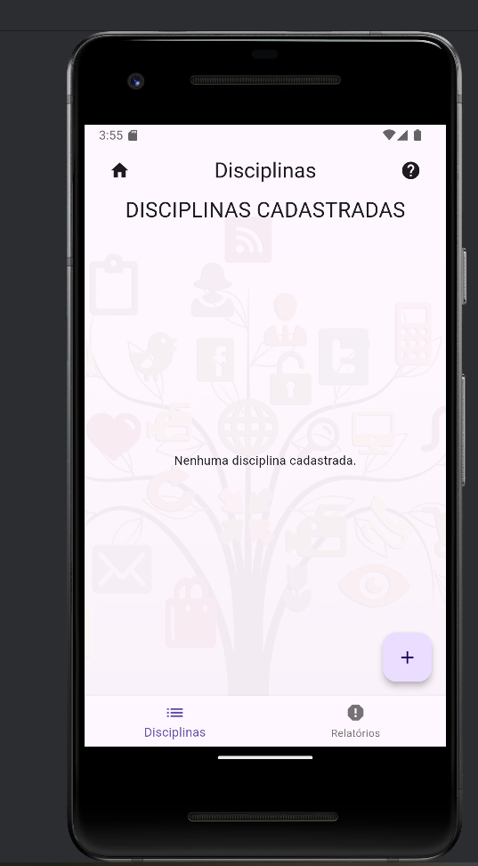
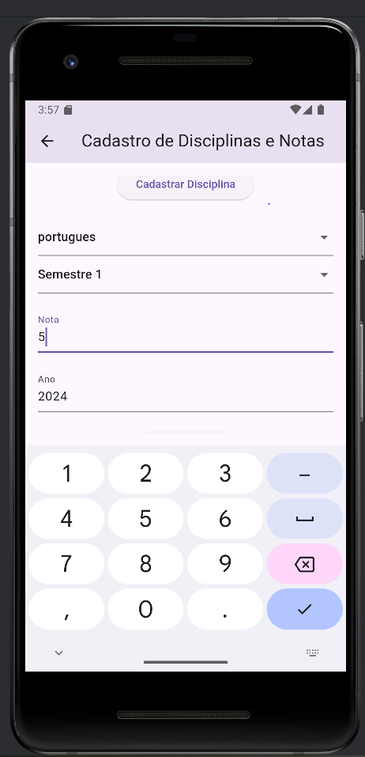
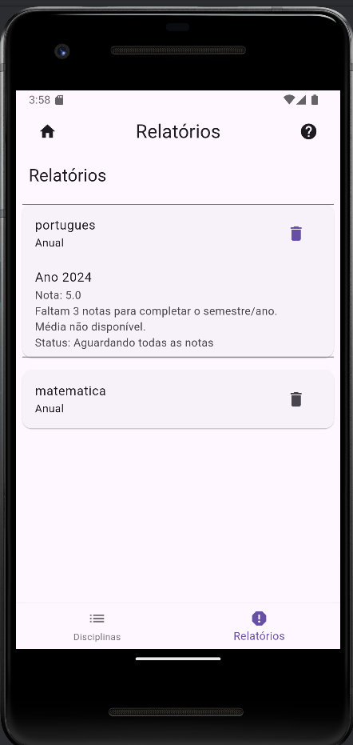
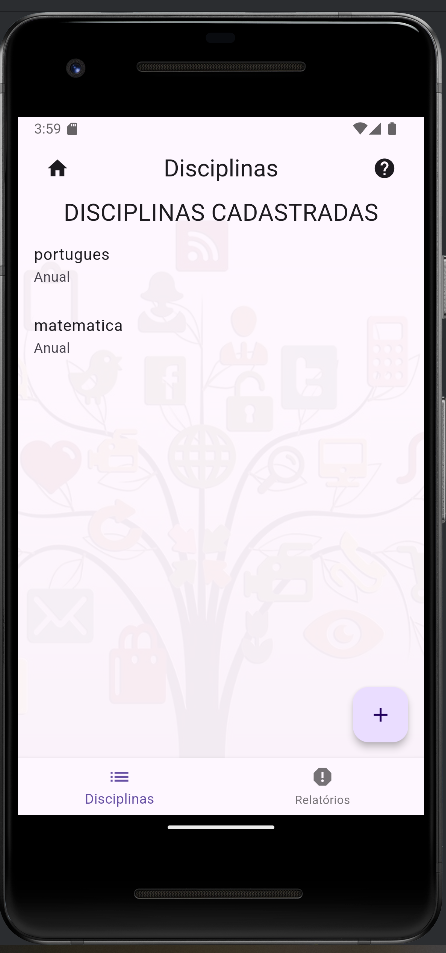
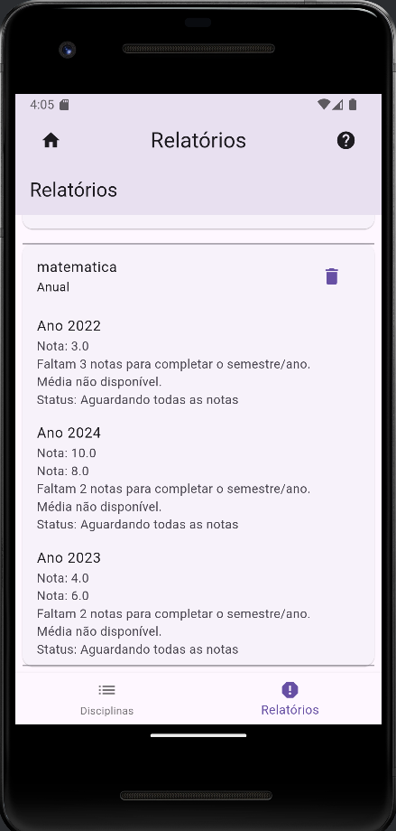
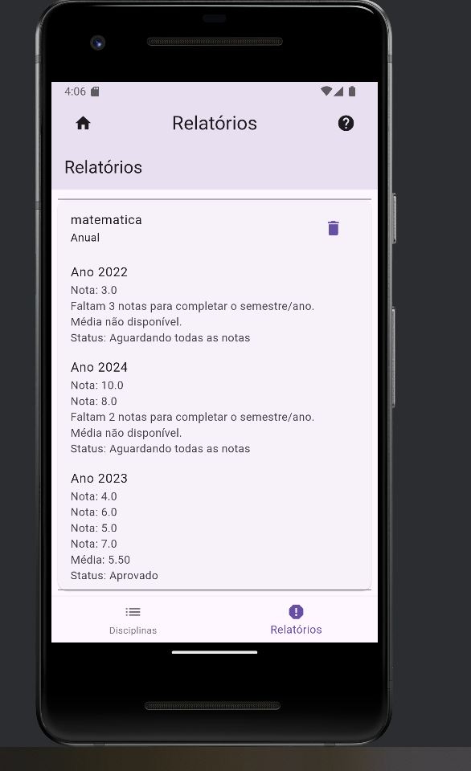

# conclusao_curso_flutter_boletim_academico

aplicativo para controle do boletim acadêmico do aluno

## Getting Started

 Cadastros

o Cadastro de disciplinas;

o Cadastro de notas;

 Funcionalidades:

o Na disciplina deve conter a informação se é semestral (possui 2 bimestres/notas) ou anual (possui
4 bimestres/notas);

o Lançamento de Notas por disciplina;

o A média deve ser calculada baseado no tipo do curso (Anual ou Semestral);
 Regras para aprovação:

o Obter pelo menos 5,0 pontos (50%) de média final;

 Relatórios
o Listar todas as disciplinas, com a média e exibindo se está aprovado ou reprovado;
 Requisitos técnicos:

o Utilizar o MobX ou algum outro gerenciador de estados;

o Utilizar o SQLite ou algum outro meio de salvar a informações locais no celular

This project is a starting point for a Flutter application.

A few resources to get you started if this is your first Flutter project:

-

- 
- [Lab: Write your first Flutter app](https://docs.flutter.dev/get-started/codelab)
- [Cookbook: Useful Flutter samples](https://docs.flutter.dev/cookbook)

For help getting started with Flutter development, view the
[online documentation](https://docs.flutter.dev/), which offers tutorials,
samples, guidance on mobile development, and a full API reference.
